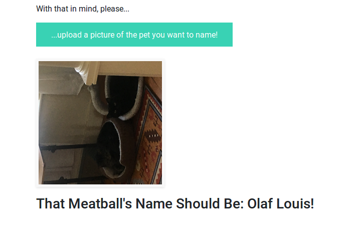

## Intro
Sometimes you've got a cat or a dog and you just don't know what to call the dang beastie! This app might help. A name's just a kind of caption for a visual object, if you think about it, and we have excellent tech out there to do just that kind of job. 

**Name!That!Meatball!** uses a simple image captioning deep neural network developed in Keras over a corpus of several thousand images of pets, along with their names, scraped from PetFinder using [petpy](https://github.com/aschleg/petpy). It will spin up a simple local web-app that will allow you to drag a picture into it and get a pet name back. Note that even with the righteous chops [petpy's](https://github.com/aschleg/petpy) bringing to the table, the process of scraping the data and training the model is somewhat involved, and so for now is planned for a separate repository.

## Here's an example of what kind of results you can expect:

## Sometimes it even seems to recognize that you might be naming more than one meatball at a time!

## Setup
1. Clone or download the repository.
2. Download the pre-trained model components from this link: https://tinyurl.com/yb5nfxfs
3. Extract the folder to the app directory.
4. Create an appropriate environment using the requirements.txt file (I recommend Anaconda).
5. Activate the environment and run "python app.py" in the app directory.

## Note
Sometimes you'll just get a spinning cursor instead of getting a name back. This indicates that the model's returned _no_ name, and is probably a by-product of the model being overfitted. I'll post a re-trained model to the above link at some point in the near future that should avoid that issue. In the mean time, try a different picture of your sweet nugget; it may work anyway.
